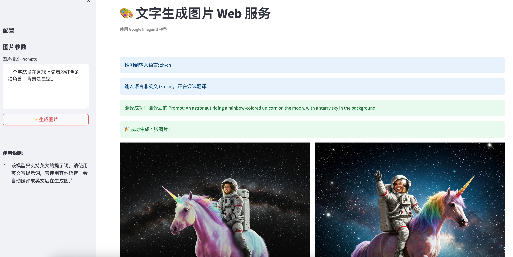
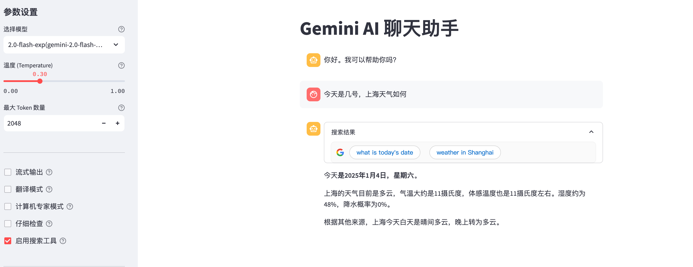
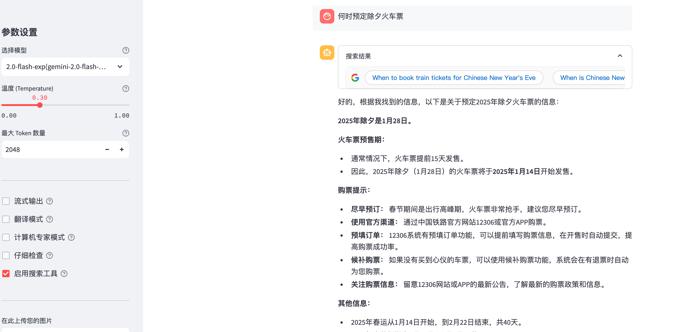
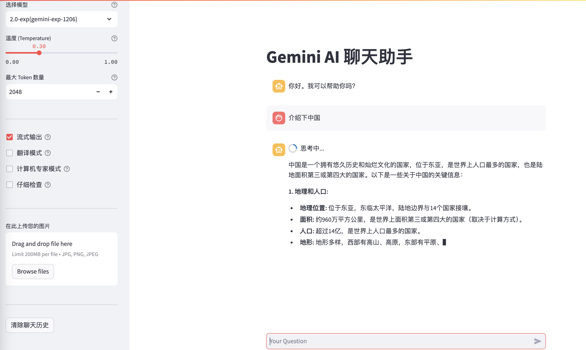
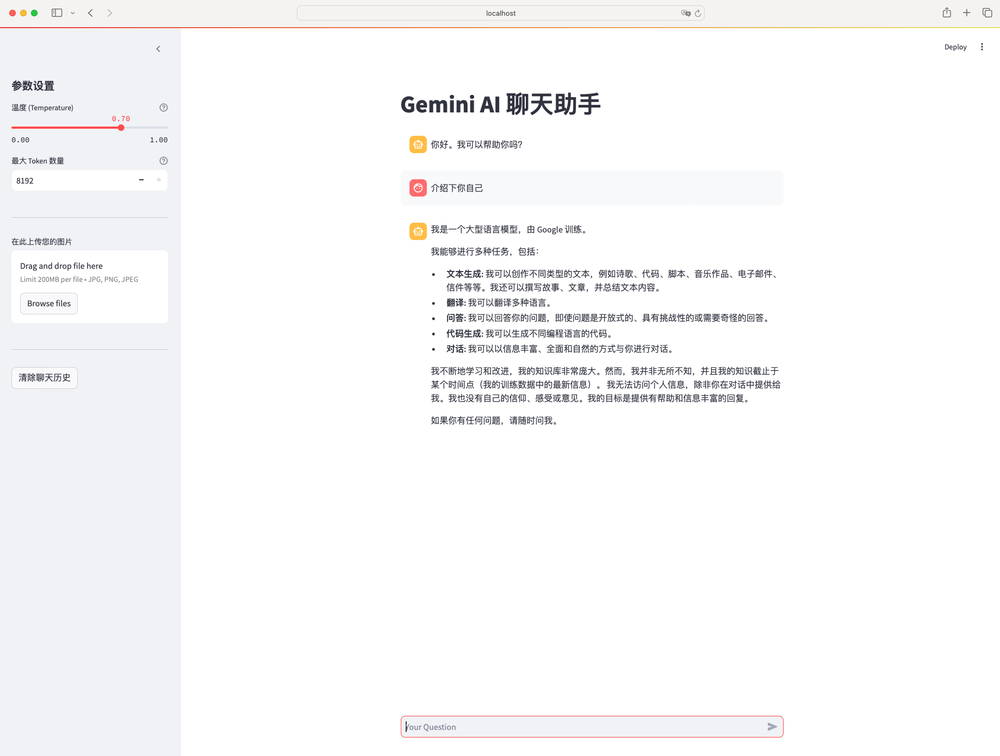
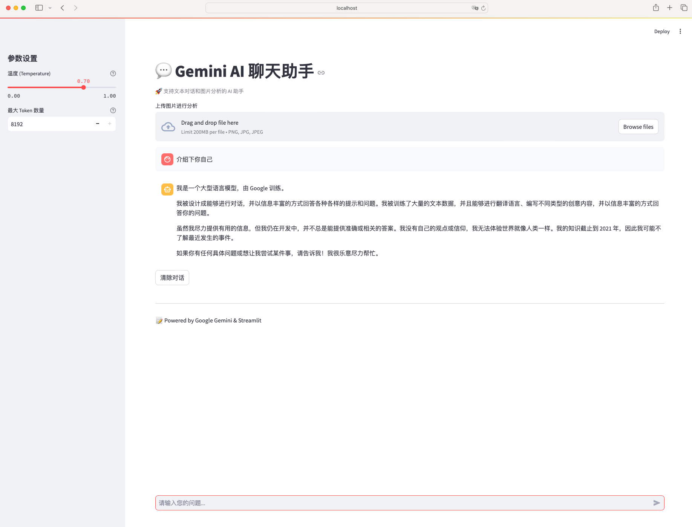

# Streamlit + Google Gemini 聊天程序

基于 Streamlit 和 Google Gemini 构建的智能聊天应用，支持文本对话和图片分析功能。

## 功能特点

- 💬 支持自然语言对话
- 🤖 支持多种模型选择 (`gemini-2.0-flash`, `gemini-2.5-exp`, `gemini-2.5-flash`)
- 📝 支持流式输出回复
- 🖼️ 支持图片上传和分析,生成
- 🔍 支持 Google 搜索功能，对话时可获取最新的知识
- 🚀 简单易用的 Web 界面
- 💻 基于 Streamlit 快速部署

## 使用前准备

1. 获取 Google Gemini API Key
2. 安装必要的依赖包：
```python
pip install streamlit google-generativeai google-genai pillow
```

## 使用方法

1. 设置环境变量：
```bash
export GOOGLE_API_KEY="your-api-key"
```

也可以在app.py中直接修改GOOGLE_API_KEY：
```python
# GOOGLE_API_KEY = os.getenv('GOOGLE_API_KEY')
GOOGLE_API_KEY = "your-api-key"
```

2. 运行应用：
```bash
streamlit run app.py

# reset port
streamlit run --server.port 8080 app.py
```

**说明**
> app.py: 界面更加整洁 <br>
> app2.py: 页面上有美观的logo <br>
> 两者功能一致，按个人喜好进行选择


3. 在浏览器中打开显示的地址（默认为 http://localhost:8501 ）

#### 效果图:
image.py展示 (体验地址：http://34.125.51.214:8086/)

search.py展示


app_computer_multi_stream.py展示

app.py展示

app2.py展示


4. 体验地址
http://34.125.51.214:8082/ （免费，无广告，无需注册登录等）

## 注意事项

- 请确保有稳定的网络连接
- API Key 请妥善保管，不要上传到公共仓库
